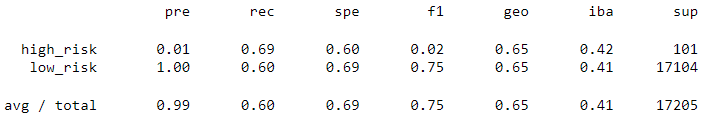
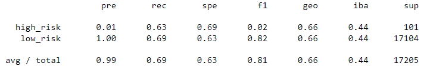
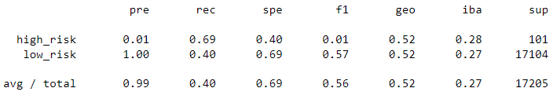
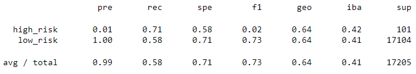
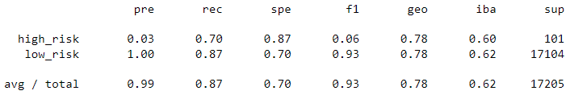
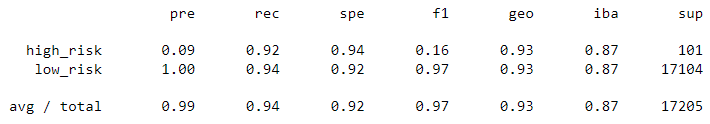

# Credit Risk Analysis

## Overview of the Credit Risk Analysis

FastLending, a peer to peer lending company, wants to use machine learning to predict credit risk. In order to complete this task, we will evaluate several supervised machine learning models to predict credit risk. We will also use techniques such as resampling and boosting to make the most of the models and data. Once the models have been designed, and implemented, we will be able to evaluate their performance, and determine how well they are able to predict data.

## Resources
- Data Source: LoanStats_2019Q1.csv
- Software: Python 3.9.6, Conda 4.10.3, Imbalanced-learn 0.8.1, Scikit-learn 1.0.1

## Results

The following results are displayed as the models that were used in our analysis, followed by a screenshot of the resulting classification report, and an approximate breakdown of the model's prediction accuracy with this type of data:

### Naive Random Oversampling

- Balanced Accuracy Score: 64.7%
- Precision: 99.7%
- Recall: 60.2%

### SMOTE Oversampling

- Balanced Accuracy Score: 66.2%
- Precision: 99.7%
- Recall: 69.1%

### Cluster Centroids Undersampling

- Balanced Accuracy Score: 54.4%
- Precision: 99.5%
- Recall: 39.5%

### SMOTEENN Combination (Over and Under) Sampling

- Balanced Accuracy Score: 64.6%
- Precision: 99.7%
- Recall: 57.9%

### Balanced Random Forest Classifier

- Balanced Accuracy Score: 78.9%
- Precision: 99.8%
- Recall: 87.4%

### Easy Ensemble AdaBoost Classifier

- Balanced Accuracy Score: 93.2%
- Precision: 99.9%
- Recall: 94.3%

## Summary

Before we analyze the results, we must decide what metric of accuracy is the most important for FastLending. In this data set, the precision metric represents the degree of applications which should be labeled as low risk that were incorrectly labeled as high risk. And the recall metric represents the degree of applications which should be labeled high risk that were incorrectly labeled as low risk. Mislabeling a low risk application as high risk can cost FastLending in terms of potential profits for passing on a strong application, but this can be mitigated by having any high risk application flagged for a more thorough review instead of declining the application outright. But, mislabeling a high risk application as low risk can be extremely costly for FastLending as it could lead to a larger number of defaults. So, in FastLending’s case, it is crucial to have a high recall in our predictions to minimize the mislabeling high risk applications as low risk. Looking back at our results we can see that the Easy Ensemble AdaBoost Classifier model gave us the highest recall, and should be the only model worth consideration. Conveniently, that same model also gave us the highest balanced accuracy score and precision which makes it unanimously the model of best fit in this dataset. 